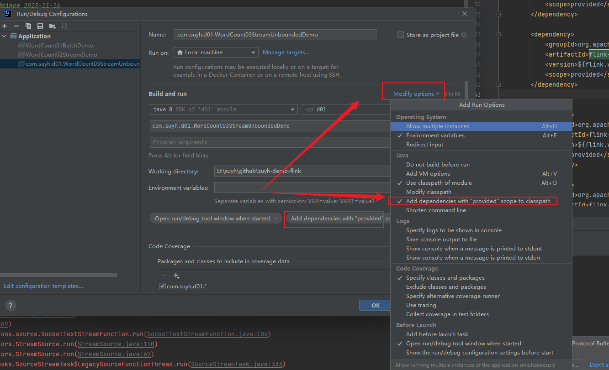

## provided 的本地运行

idea 环境




## 分层api

- 有状态流处理

  process

- 核心APIS

  - DataStream API(推荐)
  - DataSet API(过时了)

- Table API

  声明式领域专用语言

- SQL

  最高层语言

## flink部署

### 集群角色

- JobManager
- TaskManger
- FlinkClient

### 下载安装包

官网：https://flink.apache.org

下载地址：https://dlcdn.apache.org/flink/flink-1.17.2/flink-1.17.2-bin-scala_2.12.tgz


 

```shell
# 解压
tar -zxvf flink-1.17.2-bin-scala_2.12.tgz -C /opt/module/
cd /opt/module/flink-1.17.2

```


### 配置

#### 修改配置 JobManager

指定一个服务实例为JobManager，然后进入到该主机，修改对应的配置文件

> vim conf/flink-conf.yaml

```properties
# JobManager节点地址.
jobmanager.rpc.address: flink01.isuyh.com
jobmanager.bind-host: 0.0.0.0
rest.address: flink01.isuyh.com
rest.bind-address: 0.0.0.0
# TaskManager节点地址.需要配置为当前机器名
taskmanager.bind-host: 0.0.0.0
taskmanager.host: flink01.isuyh.com

```

> 修改workers
>
> vim conf/workers

```properties
flink01.isuyh.com
flink02.isuyh.com
flink03.isuyh.com
```

> vim conf/masters

```properties
flink01.isuyh.com:8081
```

#### 修改配置TaskManager

将上面JobManager的配置对应修改

> vim conf/flink-conf.yaml

```properties
# JobManager节点地址.
jobmanager.rpc.address: flink01.isuyh.com
jobmanager.bind-host: 0.0.0.0
rest.address: flink01.isuyh.com
rest.bind-address: 0.0.0.0
# TaskManager节点地址.需要配置为当前机器名
taskmanager.bind-host: 0.0.0.0
# 主要是这里，自己的服务器域名
taskmanager.host: flink02.isuyh.com
```

另一个TaskManager

```properties
# JobManager节点地址.
jobmanager.rpc.address: flink01.isuyh.com
jobmanager.bind-host: 0.0.0.0
rest.address: flink01.isuyh.com
rest.bind-address: 0.0.0.0
# TaskManager节点地址.需要配置为当前机器名
taskmanager.bind-host: 0.0.0.0
# 主要是这里，自己的服务器域名
taskmanager.host: flink03.isuyh.com
```

### 启动

> bin/start-cluster.sh
>
> 如果报错，就安装一个jdk 就好

### 网页访问

> http://flink01.isuyh.com:8081
>
> 而访问flink02.isuyh.com:8081 是访问不通的，看来是只能在JobManager 所在的ip 才能访问。


