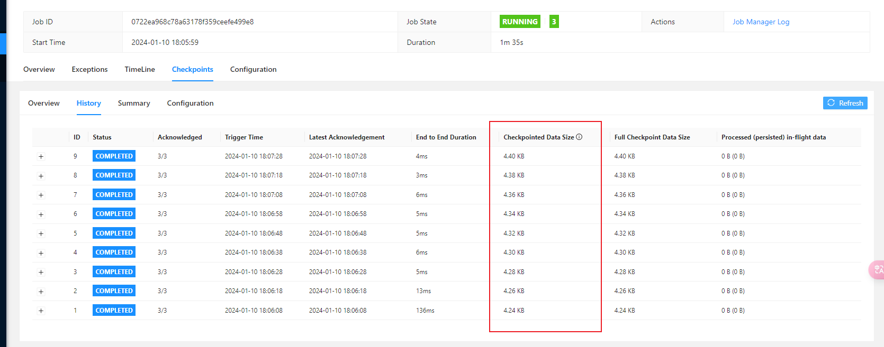

```txt
记录keyby 的数量对checkpoint 的影响
keyby 的数量随时间增长
```


> 每一次checkpoint 时间间隔增加一个keyby 的数量
>
> 即每10 秒增加一个keyby 的key 值


## 每一批checkpoint 增加一个key ，每一批checkpoint 1000 条数据

> 每增加一个key，checkpoint 增加2KB 的存储空间。



