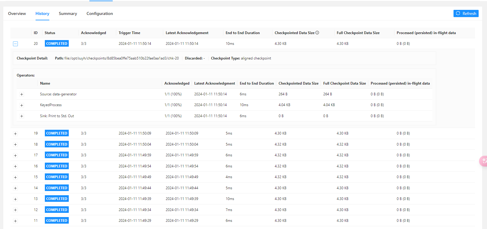

```txt
记录keyby 的数量对checkpoint 的影响
keyby 的数量随时间进行周期性的增与减少
数量随时间的变化大概如下：
1 2 3 4 5 5 4 3 2 1 1 2 3 4 5
```


> 每一次checkpoint 时间间隔增加一个keyby 的数量
>
> 即每10 秒增加一个keyby 的key 值
>
> 每5 次checkpoint 为一个周期，每奇数次周期为keyby 数量的递增，每偶数次周期为keyby 数量的递减


## state ttl参数

```java
StateTtlConfig stateTtlConfig = StateTtlConfig
        .newBuilder(Time.seconds(stateTtlSecond)) // 过期时间
        .setUpdateType(StateTtlConfig.UpdateType.OnCreateAndWrite) // 状态 创建和写入（更新） 更新 过期时间
        .setStateVisibility(StateTtlConfig.StateVisibility.NeverReturnExpired) // 不返回过期的状态值
        .build();
```


### 取样一

> checkpoint 间隔时间(5s)  >  state ttle 时间(3s)

#### 1 - 10


#### 11 - 20




#### 21 - 30


### 取样二

> checkpoint 间隔时间(3s)  <  state ttle 时间(5s)

#### 1-10


#### 11-20


#### 21-30


## state ttl 参数

```java
// 禁用了更新类型
StateTtlConfig stateTtlConfig = StateTtlConfig
        .newBuilder(Time.seconds(stateTtlSecond)) // 过期时间
        .setUpdateType(StateTtlConfig.UpdateType.Disabled)
        .setStateVisibility(StateTtlConfig.StateVisibility.NeverReturnExpired) // 不返回过期的状态值
        .build();
```


### 取样一

#### 1-10


#### 11-20


#### 21-30


## state ttl 参数

```java
// 增加了 cleanupFullSnapshot() 的配置
StateTtlConfig stateTtlConfig = StateTtlConfig
        .newBuilder(Time.seconds(stateTtlSecond))
        .setUpdateType(StateTtlConfig.UpdateType.OnCreateAndWrite)
        .setStateVisibility(StateTtlConfig.StateVisibility.NeverReturnExpired)
        .cleanupFullSnapshot() 
        .build();
```


### 取样一

> checkpoint 间隔时间(5s)  >  state ttle 时间(3s)

#### 1-10


#### 11-20


#### 21-30


### 取样二

> checkpoint 间隔时间(3s)  <  state ttle 时间(5s)

#### 1-10


##### 11-20


##### 21-30

