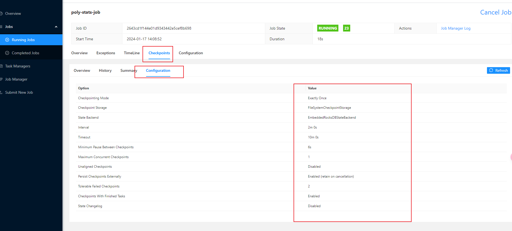
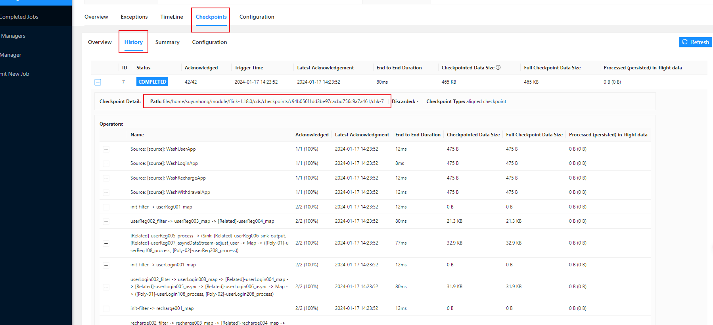

## v32 -> v34.1

> v33 版本之前被使用，跳过v33

## 相对于上一个版本的变化 

1. 处理BUG，写sink 时配置被覆盖，两条sink 写到同一个MQ 中了
2. vo 对象的toString() 方法，改用lombok 自动生成，不再手动维护，有遗漏的属性字段未打印输出。
3. flink 从1.13.1 升级到1.18.0。
4. 调整日志输出，减少标准输出信息，转到日志文件。
5. 集成spring boot 
6. 使用spring boot 的配置能力，优化项目相关配置文件以及配置项
7. 不再使用原生的mysql、redis 组件，使用spring boot 提供的mysql 组件替代
8. 增加灵活性，添加外置配置文件路径的配置项
9. 尽量使用flink 官方提供的配置项，而不再额外定义。


## 注意

> 目前该版本主要针对流模式验证过，对于跑批。还未完全测试。

## 安装与部署

1. 解压文件

   ```shell
   # 将flink-1.18.0-bin-scala_2.12.tgz 解压，其中-C 参数可以指定要解压的目录(如：/opt/module/)，如果不指定默认为当前目录
   tar -zxvf flink-1.18.0-bin-scala_2.12.tgz -C /opt/module/
   ```

2. 修改flink 的相关配置

   > 进入flink 根目录

   ```shell
   # 首先进入到flink 的根目录，如：/opt/module/flink-1.18.0
   cd /opt/module/flink-1.18.0
   ```

   > 参考之前版本的配置修改
   >
   > 可以参考提供的  flink-conf.yaml 文件，但还是有需要修改的地方，所有修改的地主都添加了标识：# TODO: suyh - 

   ```shell
   # 修改conf/flink-conf.yaml 文件的相关配置项，对于之前版本的相关配置可以迁移过来
   vim conf/flink-conf.yaml
   ```

   > 注释掉java 17 才需要的参数，正常情况我们使用的应该是java 8 ，如果使用的是java 17 则需要打开注释。
   >
   > 大概在文件的第20 行

   ```yaml
   # These parameters are required for Java 17 support.
   # They can be safely removed when using Java 8/11.
   # env.java.opts.all: --add-exports=java.base/sun.net.util=ALL-UNNAMED --add-exports=java.rmi/sun.rmi.registry=ALL-UNNAMED --add-exports=jdk.compiler/com.sun.tools.javac.api=ALL-UNNAMED --add-exports=jdk.compiler/com.sun.tools.javac.file=ALL-UNNAMED --add-exports=jdk.compiler/com.sun.tools.javac.parser=ALL-UNNAMED --add-exports=jdk.compiler/com.sun.tools.javac.tree=ALL-UNNAMED --add-exports=jdk.compiler/com.sun.tools.javac.util=ALL-UNNAMED --add-exports=java.security.jgss/sun.security.krb5=ALL-UNNAMED --add-opens=java.base/java.lang=ALL-UNNAMED --add-opens=java.base/java.net=ALL-UNNAMED --add-opens=java.base/java.io=ALL-UNNAMED --add-opens=java.base/java.nio=ALL-UNNAMED --add-opens=java.base/sun.nio.ch=ALL-UNNAMED --add-opens=java.base/java.lang.reflect=ALL-UNNAMED --add-opens=java.base/java.text=ALL-UNNAMED --add-opens=java.base/java.time=ALL-UNNAMED --add-opens=java.base/java.util=ALL-UNNAMED --add-opens=java.base/java.util.concurrent=ALL-UNNAMED --add-opens=java.base/java.util.concurrent.atomic=ALL-UNNAMED --add-opens=java.base/java.util.concurrent.locks=ALL-UNNAMED
   ```

   > 添加新配置到`conf/flink-conf.yaml`，对于之前版本程序中自定义的配置，我们现在直接使用 flink 的官方配置。具体如下: 

   ```yaml
   # 状态后端使用rocksdb
   state.backend.type: rocksdb
   # 增量checkpoint
   state.backend.incremental: true
   # 持久化文件，checkpoint 存储目录
   # 该配置对应原 flink-job.properties 文件中的: checkpointpath=file:///opt/trend_oper/checkpoints
   state.checkpoints.dir: file:///home/suyunhong/module/flink-1.18.0/cds/checkpoints
   
   # 两次checkpoint 之间的间隔时间
   # 该配置对应原 flink-job.properties 文件中的: checkpointInterval = 120000
   execution.checkpointing.interval: 120000
   # 两次checkpoint 之间的最小间隔时间
   execution.checkpointing.min-pause: 6000
   # checkpoint 超时时间
   # 该配置对应原 flink-job.properties 文件中的: checkpointTimeout = 600000
   execution.checkpointing.timeout: 600000
   # checkpoint 最大并发量
   execution.checkpointing.max-concurrent-checkpoints: 1
   # 取消job 时checkpoint
   execution.checkpointing.externalized-checkpoint-retention: RETAIN_ON_CANCELLATION
   # checkpoint 允许失败次数
   # 该配置对应原 flink-job.properties 文件中的: checkpointFailureNumber = 2
   execution.checkpointing.tolerable-failed-checkpoints: 2
   ```

3. 自定义扩展配置项

   > 该配置文件用于替代原配置文件：`flink-job.properties`
   >
   > 首先在flink 的配置文件`conf/flink-conf.yaml` 中添加自定义的配置文件所在位置。如果没有指定，默认取: `/opt/trend_oper/cds-job-conf.yaml`
   >
   > 参考如下：

   ```yaml
   # 默认值：/opt/trend_oper/cds-job-conf.yaml
   cds.flink.spring.yaml-path: /home/suyunhong/module/flink-1.18.0/cds/cds-job-conf.yaml
   ```

   > 在自定义的配置文件中，补充相关配置，具体参考示例文件: `cds-job-conf.yaml`。

4. 修改日志配置，将行号显示在日志文件中

   > vim conf/log4j.properties
   >
   > 可以参考提供的  conf/log4j.properties 文件

   ```shell
   # 大概在该文件的第50 行，修改如下
   # appender.main.layout.pattern = %d{yyyy-MM-dd HH:mm:ss,SSS} %-5p %-60c %x - %m%n
   appender.main.layout.pattern = %d{yyyy-MM-dd HH:mm:ss,SSS} %-5p %-60c:%L %x - %m%n
   ```

5. 将提供的相关jar 包文件拷贝到lib 目录

   > 拷贝相关依赖包到 lib 目录

   ```shell
   # FLINK_HOME 是flink 的根目录，比如：/opt/module/flink-1.18.0
   # flink-plus 和usrlib 目录中的文件为当前我们所依赖的相关的 二方件、三方件以及flink 自带jar 以外的包文件
   cp -r flink-plus/ ${FLINK_HOME}/lib/
   cp -r usrlib/ ${FLINK_HOME}/lib/
   ```

6. 拷贝flink 的运行文件到flink 根目录

   > 拷贝flink 的运行文件到flink 根目录

   ```shell
   # flink job 提交jar 文件
   cp flink_dynamic_trend_oper-34.1.jar ${FLINK_HOME}/
   ```

## 启动运行

1. 启动flink

   ```shell
   # 先停止
   bin/stop-cluster.sh
   # 再启动
   bin/start-cluster.sh
   ```

2. 提交作业

   ```shell
   # 如果要在指定并行度，使用 -p 参数。
   # 在standalone 模式，并行度的数量应该与槽的数量一致，所以并行度与槽直接在conf/flink-conf.yaml 中配置最为合适。
   bin/flink run -d  flink_dynamic_trend_oper-34.1.jar
   ```

3. 如果要从保存点提交作业使用如下命令

   ```shell
   # -s 参数指定保存点的目录，其中：`87a3850020b5e1f74659a1169c737ed2` 是jobid。
   bin/flink run -d -s file:///home/suyunhong/module/flink-1.18.0/cds/checkpoints/87a3850020b5e1f74659a1169c737ed2/chk-17/ flink_dynamic_trend_oper-34.1.jar
   ```

4. 停止作业

   ```shell
   # 指定停止哪一个作业需要提供JobID
   ./bin/flink cancel <JobID>
   # 要停止jobID 87a3850020b5e1f74659a1169c737ed2 应使用如下命令
   ./bin/flink cancel 87a3850020b5e1f74659a1169c737ed2
   ```

5. 其他

## 验证

> 作业运行成功，检查页面上生效的配置，是否与配置的结果一致
>
> 大概如下




